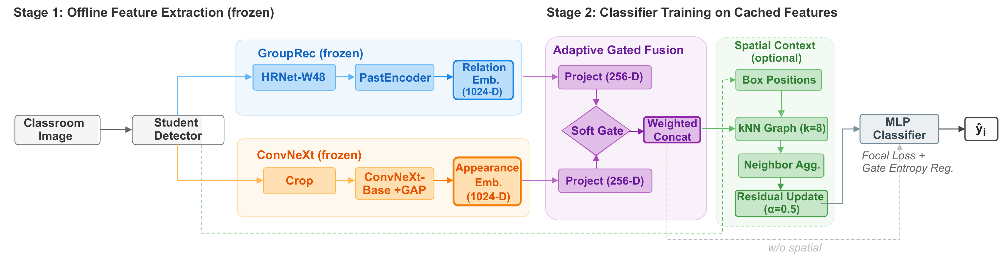

# RAFNet

**A Relation-Aware Adaptive Fusion Network for Dense Classroom Student Behavior Recognition**

[](https://opensource.org/licenses/MIT)
[](https://www.python.org/downloads/release/python-380/)
[](https://pytorch.org/)

This repository contains the implementation code for the paper *RAFNet: A Relation-Aware Adaptive Fusion Network for Dense Classroom Student Behavior Recognition* (Xia et al., 2026). The code extends [GroupRec (ICCV 2023)](https://github.com/boycehbz/GroupRec): upstream code is preserved without functional modification, and RAFNet is added as a parallel self-contained module.

> **Note on naming.** The internal Python package is `prism/` — RAFNet's development codename. The paper refers to the method as RAFNet; both names refer to the same model.



---

## Overview

RAFNet classifies per-student behaviors in dense classroom images. The method fuses two 1024-D features:

- **Relation** embeddings produced by a pretrained GroupRec hypergraph encoder, which encode group-level context and peer interactions
- **Appearance** features produced by ConvNeXt-Base, which encode each student's local visual evidence

The fusion head uses a gated structure that weights the two streams per sample, with an entropy regularization term applied during training. The C+Spatial variant additionally constructs a same-image spatial graph that propagates information between spatially adjacent detections within the same image.

**Results on NCST Classroom** (5-seed mean ± std, Macro F1 excluding the Null class):

| Model | Macro F1 (no-null) | Accuracy |
|-------|:------------------:|:--------:|
| ConvNeXt-only (loss-tuned)   | 60.29 ± 0.38 | 62.44 ± 0.22 |
| Gated (loss-tuned)           | 62.47 ± 1.20 | 64.60 ± 1.21 |
| **C+Spatial (loss-tuned)**   | **63.08 ± 0.40** | **65.46 ± 0.66** |

Cross-backbone (ResNet-50 / ViT-B/16) and cross-dataset (SCB3-U, 96.76 Macro F1) results are reported in the paper.

---

## Environment

This repository manages its environment with [**pixi**](https://pixi.sh). pixi resolves conda packages, PyPI packages, and CUDA toolchains in a single lockfile, and supports per-feature sub-environments.

Install pixi (one line, no root required):
```bash
curl -fsSL https://pixi.sh/install.sh | bash
```

Then:
```bash
pixi install          # default env (Quick Run); solve takes ~2 minutes
pixi task list        # list all available commands
pixi run smoke        # verify the environment
```

The end-to-end pipeline (feature extraction on new images, which requires SMPL and GroupRec weights) additionally depends on mayavi / open3d / pyrender / vtk:
```bash
pixi install -e e2e                   # install the e2e feature
pixi run -e e2e pip install chumpy    # chumpy must be installed via pip after env creation
```

If you prefer conda/venv, `pixi.toml` lists the full dependency set. Nothing in this repository depends on pixi beyond invocation convenience.

---

## Quick Run

Train and evaluate RAFNet fusion heads on **pre-extracted features**. This path does not exercise the GroupRec / SMPL / YOLOX inference stack.

### 1. Download features and checkpoints

Pre-extracted NCST features and SOTA checkpoints are published as release assets under [v1](https://github.com/NihilDigit/RAFNet/releases/tag/v1). SHA256 checksums are listed in the release notes.

```bash
# Features (726 MB): train / val / test pkl for NCST with context sidecar
wget https://github.com/NihilDigit/RAFNet/releases/download/v1/rafnet_features.tar.gz
tar xf rafnet_features.tar.gz -C output/

# Trained checkpoints (179 MB): 15 paper-reported configs × 5 seeds = 75 checkpoints
# Optional — skip if training from scratch.
wget https://github.com/NihilDigit/RAFNet/releases/download/v1/rafnet_checkpoints.tar.gz
tar xf rafnet_checkpoints.tar.gz
```

### Bundled demo assets (`demo/`)

The repository ships a 3-scene demo so that `pixi run demo` can run without additional downloads:

| Path | Size | Description |
|------|------|-------------|
| `demo/images/` | ~0.6 MB | Three NCST test scenes with **human faces blurred**. |
| `demo/features.pkl` | ~1.2 MB | Pre-extracted GroupRec + ConvNeXt embeddings, together with bbox geometry, for the same three scenes. |
| `demo/ckpts/` | ~6 MB | Seed-43 checkpoints for C+Spatial (RAFNet) and ConvNeXt-only. |

**Note on data provenance**: To protect the identities of students in the source data, the images under `demo/images/` have been face-blurred via the `deface` tool (CenterFace backend). The feature vectors in `demo/features.pkl` were extracted once, offline, from the original non-blurred images, then filtered to these three scenes. That is: the blurred pixels and the cached features originate from different image states. Paper Fig 4 (`ch4_qualitative_results.pdf`) uses the same recipe, so `pixi run demo` reproduces the per-image accuracy reported in the paper:

| Scene | # people | ConvNeXt-only | RAFNet | Δ |
|-------|:--------:|:-------------:|:-----:|:---:|
| 166 | 60 | 28.3% | 46.7% | +18.4 |
| 89  | 51 | 54.9% | 64.7% | +9.8  |
| 900 | 40 | 67.5% | 87.5% | +20.0 |

Re-extracting features from the blurred images (e.g. `pixi run -e e2e extract --data-root demo`) will produce per-image accuracy that diverges from the paper. The cause is degraded input to the HRNet backbone, not an implementation error. The features are 1024-D pooled embeddings and cannot be used to reconstruct faces; their distribution is therefore privacy-safe even though they originate from non-blurred inputs.

The blurred images are derivatives of the NCST Classroom dataset and inherit its research-use terms. They are not licensed for redistribution outside of academic reproduction of this paper.

### 2. Run

```bash
# Paper Table 1 main subset (6 models × 5 seeds, ~30 trainings)
pixi run repro-main

# Full reproduction (10 models × 5 seeds, including C+Spatial and GroupRec-3D variants)
pixi run repro

# Train a single seed of a single model
pixi run train --model grouprec_convnext_gated_c_spatial_graph_loss_tuned --seed 43

# Aggregate across seeds (safe to re-run at any time)
pixi run eval

# Reproduce the paper Fig 4 qualitative comparison
pixi run figures

# External baselines (LogReg / Linear SVM / Late fusion / LMF)
pixi run baselines

# Tier-2 diagnostics (per-class F1, confusion matrices, throughput)
pixi run tier2
```

Optional hyperparameter and ablation tools are located in `prism/scripts/analysis/` (gate statistics, counterfactual modality removal, ensemble weight search, temperature calibration).

---

## End-to-End (feature extraction on new images)

This path runs the full inference pipeline on new classroom images. It requires additional third-party weights.

### Download weights

Place under `data/`:

| File | Size | Source |
|------|------|--------|
| `J_regressor_h36m.npy`        | 1 MB   | Already in this repository |
| `J_regressor_halpe.npy`       | 0.7 MB | Already in this repository |
| `SMPL_NEUTRAL.pkl`            | 39 MB  | [SMPLify website](http://smplify.is.tuebingen.mpg.de/); registration required |
| `relation_joint.pkl`          | 117 MB | [Upstream Baidu Netdisk](https://pan.baidu.com/s/14BD-i_wUBV_wEh3l1yo0IQ?pwd=tucv) (password: `tucv`) |
| `relation_common_group8.pkl`  | 326 MB | Same Baidu link |
| `bytetrack_x_mot17.pth.tar`   | 793 MB | Same Baidu link, or [ByteTrack release](https://github.com/ifzhang/ByteTrack) |

> These files are distributed by the SMPL project (MPI) and by the GroupRec authors. This repository does not redistribute them. If the Baidu link is inaccessible, contact the respective upstream authors directly.

### Extract features

```bash
pixi run -e e2e extract        # GroupRec relation + ConvNeXt features
pixi run -e e2e extract-3d     # optional: GroupRec-3D output features (for ablation)
```

### Upstream 3D pose demo

The original GroupRec 3D pose / SMPL demo is preserved without modification:
```bash
pixi run -e e2e python demo.py --config cfg_files/demo.yaml        # pose
pixi run -e e2e python demo.py --config cfg_files/demo_smpl.yaml   # SMPL
```

---

## Results layout and reproducibility

Each training run writes a complete provenance record:

```
results/
├── training/
│   └── {model_name}/
│       ├── seed_{N}/
│       │   ├── best_model.pth            # best checkpoint, selected by val macro_f1_no_null
│       │   ├── results.json              # test metrics and provenance metadata
│       │   ├── training_history.json     # per-epoch train/val records
│       │   └── config.yaml               # frozen config snapshot
│       └── all_seeds_summary.json        # written after multi-seed runs
└── evaluation/
    ├── final_results.json                # cross-seed aggregation (mean ± std)
    └── final_results.csv                 # the same, as CSV
```

Each `results.json` records three provenance markers:
- `git_commit` — code version
- `pixi_lock_hash` — environment fingerprint
- `feature_tag` — timestamp of the feature-extraction batch

If reproduced numbers deviate from those published here, these markers help locate the source of the divergence (code, environment, or data).

**Primary metric**: `macro_f1_no_null` (Macro F1 excluding the `Null` ambiguity class). It is used for checkpoint selection, LR scheduling, and cross-model comparison, consistent with paper §4.2.

---

## Repo layout

```
RAFNet/
├── prism/                   # RAFNet classifier (codename: PRISM; new in this work)
│   ├── configs/             # Model configs (YAML, with _base_ inheritance)
│   ├── data/                # MultiModalDataset (loads feature pkl)
│   ├── models/              # Fusion heads: MLP, Gated, Disentangled, Context-Graph, Cross-Attn, ...
│   ├── losses/              # FocalLoss with label smoothing and log-balanced class weights
│   ├── training/            # Training loop and optimizer/scheduler factory
│   ├── evaluation/          # Multi-seed aggregation and ensemble inference
│   ├── baselines/           # External baselines (LogReg, Linear SVM, LMF, ...)
│   ├── scripts/             # CLI entry points (train, evaluate, extract, repro bundles)
│   │   └── analysis/        # Optional diagnostics (gate stats, counterfactual drop, ...)
│   └── utils/               # Registry and YAML config loader
│
├── model/                   # Upstream GroupRec; only relation.py adds one method
├── utils/                   # Upstream utils; only smpl_torch_batch.py adds a numpy shim
├── cfg_files/               # Upstream GroupRec configs (used by the 3D pose demo)
├── datasets/, yolox/,       # Upstream (unchanged)
├── demo.py, main.py,        # Upstream 3D pose entry points
├── modules.py, process.py   # Upstream core (unchanged)
│
└── pixi.toml                # Environment and task definitions
```

**Scope of modifications to upstream code**: `model/relation.py` adds one method (a feature-extraction fast path that bypasses the regression heads and SMPL forward); `utils/smpl_torch_batch.py` adds a numpy-compatibility shim (chumpy 0.70 references numpy aliases removed in 1.24, which are restored before SMPL pickle loading); the entire `prism/` directory is added. All other files remain byte-for-byte identical to upstream.

---

## License

The code is released under the MIT License (inherited from upstream GroupRec); see [LICENSE](LICENSE).

Third-party assets used by the end-to-end pipeline carry their own licenses:
- SMPL (`SMPL_NEUTRAL.pkl`) — [SMPL terms](https://smpl.is.tue.mpg.de/modellicense.html)
- GroupRec pretrained weights — provided by the upstream authors under their own terms
- ByteTrack weights — see the [ByteTrack project](https://github.com/ifzhang/ByteTrack)

The NCST Classroom dataset is not publicly released due to privacy constraints (paper §4.1). Pre-extracted features (1024-D embeddings from which faces cannot be reconstructed) are published for reproduction.

## Acknowledgments

This work builds on [GroupRec (ICCV 2023)](https://github.com/boycehbz/GroupRec) by Buzhen Huang et al. Its hypergraph relational reasoning module forms the basis of the relation feature extraction path in this work.

Upstream acknowledgments (from GroupRec): [CLIFF](https://github.com/huawei-noah/noah-research/tree/master/CLIFF), [ByteTrack](https://github.com/ifzhang/ByteTrack), [LoCO](https://github.com/fabbrimatteo/LoCO), [YOLOX](https://github.com/Megvii-BaseDetection/YOLOX).
